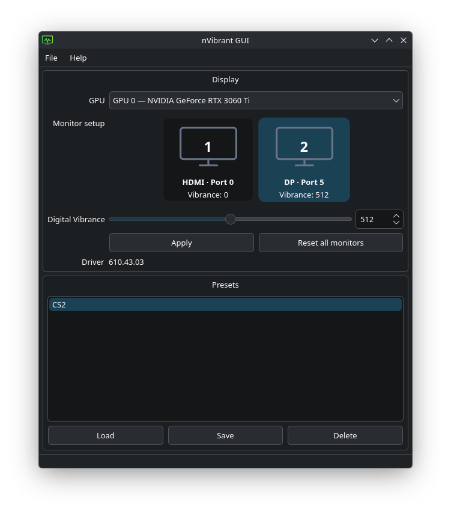

# nVibrant GUI

A native Linux Qt 6 Widgets frontend for [nvibrant](https://github.com/Tremeschin/nvibrant), focused on NVIDIA GPUs under KDE Plasma and GNOME Wayland sessions.

The application provides staged vibrance control, multiple GPU/output selection, JSON presets, a system tray, autostart, hot-plug display detection, high-DPI-aware layouts, and native error reporting. Adjustments are remembered separately as you move between monitors and sent together when Apply is pressed, while Reset all monitors clears every detected output on the selected GPU. Select a preset and use Load to apply it immediately. Display topology is monitored while the application runs; connected displays are added, removed displays disappear, and valid staged edits survive a refresh. The interface uses bounded scrolling when the window, font, or display scale cannot fit all controls. It delegates all hardware access to the upstream `nvibrant` executable using asynchronous `QProcess`; UI code never invokes a shell.

## Upstream interface assumptions

nvibrant 1.2.x accepts one positional vibrance value per physical display port. Ports are ordered by the NVIDIA driver and omitted positions default to zero. The selected GPU is passed in the `NVIDIA_GPU` environment variable. Upstream exposes no read operation, so “current value” means the last value applied during this GUI session (zero until first use), not a value queried from the driver. The GUI sends a complete remembered port vector to avoid inadvertently resetting another display.

The requested UI range is 0–1023. Upstream also supports -1024–1023, but negative/desaturation values are deliberately outside this frontend's current contract.

See [BUILD.md](BUILD.md) and [INSTALL.md](INSTALL.md). Configuration is stored in `~/.config/nvibrant-gui/config.json`, and presets in `~/.config/nvibrant-gui/presets.json`.

## License

GNU General Public License v3.0. See [LICENSE](LICENSE).
